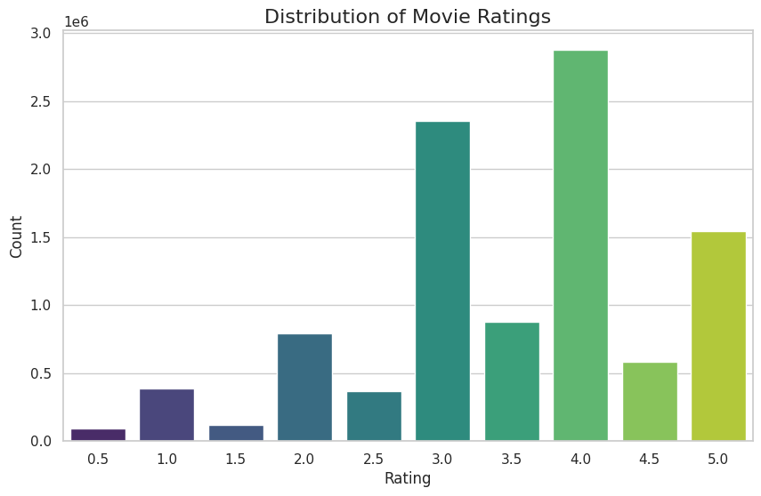
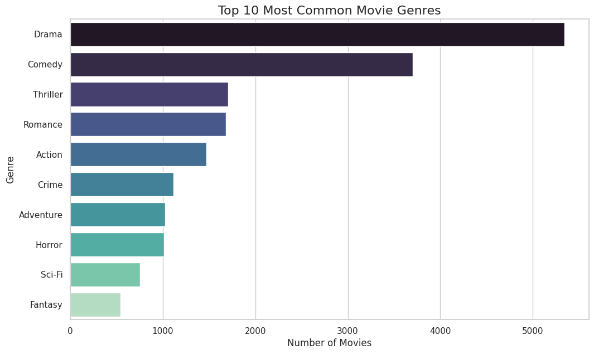

# Laporan Proyek Machine Learning - Rakha Apta Pradhana D R

## Project Overview

Dalam era digital yang dibanjiri oleh konten, pengguna seringkali kesulitan menemukan film yang sesuai dengan selera mereka di antara ribuan pilihan yang tersedia. Fenomena ini, yang dikenal sebagai information overload atau kelebihan informasi, menjadi tantangan utama bagi platform penyedia konten seperti Netflix, Amazon Prime, dan lainnya. Sistem rekomendasi hadir sebagai solusi untuk mengatasi masalah ini dengan cara menyaring dan menyajikan konten yang paling relevan bagi setiap pengguna secara personal. Dengan menganalisis preferensi pengguna dan atribut film, sistem ini tidak hanya membantu pengguna menemukan konten baru yang mereka sukai, tetapi juga secara signifikan meningkatkan engagement dan loyalitas pengguna terhadap platform.

### Mengapa dan Bagaimana Masalah Harus Diselesaikan:

Proyek ini akan membangun dua jenis sistem rekomendasi:

1. Content-Based Filtering: Menganalisis atribut film untuk menemukan film serupa.
2. Collaborative Filtering: Menganalisis pola rating dari komunitas pengguna untuk menemukan pengguna dengan selera serupa.

Dengan membandingkan kedua pendekatan ini, kita dapat memahami metode mana yang lebih efektif untuk dataset yang digunakan.  

### Hasil Riset Terkait atau Referensi:

Banyak penelitian telah membuktikan efektivitas sistem rekomendasi. Menurut riset oleh J. S. Breese, D. Heckerman, dan C. Kadie [1], pendekatan collaborative filtering telah terbukti menjadi salah satu metode yang paling berhasil dalam memprediksi preferensi pengguna dengan menganalisis pola rating dari komunitas pengguna yang lebih besar. Riset lain oleh Isinkaye, Folajimi, dan Ojokoh (2015) juga menyoroti berbagai teknik, termasuk content-based dan collaborative, sebagai fondasi utama dalam sistem rekomendasi modern [2]. Proyek ini akan mengimplementasikan kedua pendekatan tersebut untuk memberikan perbandingan yang komprehensif.

Referensi:
> [1] J. S. Breese, D. Heckerman, and C. Kadie, "Empirical analysis of predictive algorithms for collaborative filtering," *Proceedings of the Fourteenth conference on Uncertainty in artificial intelligence*, 1998, pp. 43–52.
> [2] F. O. Isinkaye, Y. O. Folajimi, and B. A. Ojokoh, "Recommendation systems: Principles, methods and evaluation," Egyptian Informatics Journal, vol. 16, no. 3, pp. 261-273, 2015.

## Business Understanding

### Problem Statements

Menjelaskan pernyataan masalah:
- Bagaimana cara membangun sebuah sistem yang dapat memberikan rekomendasi film yang dipersonalisasi berdasarkan genre film yang pernah ditonton dan disukai oleh pengguna?

- Bagaimana cara membangun sebuah sistem yang dapat merekomendasikan film berdasarkan pola rating dari pengguna lain yang memiliki selera serupa, tanpa memerlukan informasi tentang genre atau atribut film lainnya?

- Bagaimana cara mengukur dan membandingkan performa dari kedua pendekatan sistem rekomendasi tersebut untuk mengetahui tingkat akurasi dan relevansinya?

### Goals

- Mengembangkan model rekomendasi Content-Based Filtering yang mampu menyarankan film berdasarkan kesamaan genre.

- Mengembangkan model rekomendasi Collaborative Filtering menggunakan teknik faktorisasi matriks (Singular Value Decomposition atau SVD) untuk memprediksi rating dan menemukan film baru berdasarkan selera pengguna.

- Mengevaluasi kedua model menggunakan metrik yang sesuai (Precision & Recall untuk Content-Based, RMSE untuk Collaborative Filtering) untuk memahami kekuatan dan kelemahan masing-masing model.

### Solution statements
Untuk mencapai tujuan tersebut, dua pendekatan solusi akan diimplementasikan:

1. Content-Based Filtering: Pendekatan ini akan merekomendasikan film dengan menganalisis kemiripan atribut film, khususnya pada fitur genres. Teks genre akan diubah menjadi representasi numerik menggunakan TF-IDF, dan kemiripan antar film akan dihitung menggunakan Cosine Similarity. Solusi ini menjawab masalah rekomendasi berbasis atribut.

2. Collaborative Filtering: Pendekatan ini akan merekomendasikan film dengan mengidentifikasi pola tersembunyi (latent factors) dalam data rating pengguna. Teknik faktorisasi matriks, yaitu SVD, akan digunakan untuk memprediksi rating yang belum diberikan oleh pengguna dan merekomendasikan film dengan prediksi rating tertinggi. Solusi ini menjawab masalah rekomendasi berbasis komunitas.

## Data Understanding
Dataset yang digunakan dalam proyek ini adalah MovieLens 10M Dataset, yang berisi 10 juta rating film dari sekitar 72.000 pengguna untuk 10.000 film. Dataset ini merupakan sumber daya yang populer untuk penelitian dan pengembangan sistem rekomendasi karena ukurannya yang besar dan data rating yang otentik, yang memungkinkan pemodelan preferensi pengguna yang kompleks.

Dataset ini dapat diunduh melalui Kaggle: [MovieLens 10M Dataset](https://www.kaggle.com/datasets/amirmotefaker/movielens-10m-dataset-latest-version).

Data terdiri dari dua file utama: movies.dat dan ratings.dat.

Variabel pada dataset movies.dat:

- movie_id: ID unik untuk setiap film. (Tipe: numerik)
- title: Judul film beserta tahun rilisnya. (Tipe: teks)
- genres: Satu atau lebih genre yang diasosiasikan dengan film, dipisahkan oleh karakter |. (Tipe: teks)

Variabel pada dataset ratings.dat:

- user_id: ID unik untuk setiap pengguna. (Tipe: numerik)
- movie_id: ID unik film yang diberi rating. (Tipe: numerik)
- rating: Rating yang diberikan oleh pengguna, dengan skala 0.5 hingga 5.0. (Tipe: numerik)
- timestamp: Waktu pemberian rating dalam format epoch time. (Tipe: numerik)

## Data Exploration/Exploratory Data Analysis (EDA)
Analisis data eksploratif dilakukan untuk memahami distribusi dan karakteristik data.

1. **Distribusi Rating Film**  
Visualisasi menunjukkan bahwa rating paling banyak diberikan pada nilai 4.0, 3.0, dan 5.0. Hal ini mengindikasikan bahwa pengguna cenderung memberikan rating pada film yang mereka sukai, dan dataset ini lebih banyak menangkap preferensi positif daripada negatif.  

<div style="text-align: center;">
  
</div>

2. **Distribusi Genre Film**  
Visualisasi genre menunjukkan bahwa Drama dan Comedy adalah genre yang paling dominan dalam dataset. Hal ini menciptakan popularity bias, di mana model kemungkinan besar akan lebih sering merekomendasikan film dari genre-genre populer ini karena jumlah datanya yang lebih banyak.  

<div style="text-align: center;">
  
</div>

## Data Preparation
Beberapa langkah persiapan data dilakukan untuk memastikan data siap digunakan untuk pemodelan. Urutan proses ini sangat penting untuk menjamin kualitas data yang masuk ke dalam model.

1.  **Pembersihan Awal(Base prep)**:
    - **Menghapus Kolom `timestamp`**: Kolom timestamp dihapus dari data rating karena waktu pemberian rating tidak relevan untuk model baseline yang akan dibangun. Alasan utamanya adalah untuk menyederhanakan dataset dan mengurangi penggunaan memori, karena fokus utama adalah pada preferensi (rating) itu sendiri, bukan pada kapan preferensi itu dicatat.

2.  **Filter dan Penggabungan Data**:
    - **Sampling Pengguna Aktif**: Untuk efisiensi komputasi, pemodelan difokuskan pada pengguna yang paling aktif. Pengguna yang telah memberikan rating pada minimal 500 film dipilih. Alasan dari langkah ini adalah untuk memastikan model dilatih pada pengguna dengan data preferensi yang kaya dan historis, sehingga pola seleranya lebih mudah dipelajari oleh model collaborative filtering.
    - **Penggabungan Data**: Data rating yang telah disaring (ratings_sample) digabungkan dengan data film (movies) berdasarkan `movie_id`. Tujuannya adalah untuk menciptakan satu DataFrame utama yang berisi semua informasi yang dibutuhkan (user, film, rating, genre) dalam satu tempat.

3.  **Persiapan Data untuk Content-Based Filtering**:
    - **Membuat Lookup Table Film**: Sebuah DataFrame baru (`movies_df`) dibuat dari data film yang unik, dengan `movie_id` ditetapkan sebagai indeks (`set_index`). Ini berfungsi sebagai kamus atau *lookup table* yang efisien untuk mengambil informasi film berdasarkan ID-nya.
    - **Transformasi Fitur `genres`**: Karakter `|` pada kolom `genres` diganti dengan spasi (misal: "Adventure|Sci-Fi" menjadi "Adventure Sci-Fi"). Langkah ini penting agar setiap genre bisa dianggap sebagai kata atau "token" terpisah oleh `TfidfVectorizer`.
    - **Ekstraksi Fitur dengan TF-IDF**: Kolom `genres` yang sudah bersih diubah menjadi matriks numerik **TF-IDF**. Proses ini tidak hanya menghitung kemunculan sebuah genre, tetapi juga memberinya bobot berdasarkan seberapa unik genre tersebut di seluruh dataset. Hasilnya adalah representasi matematis dari "profil genre" setiap film, yang siap digunakan untuk menghitung kemiripan.
    - **Pemetaan Judul ke ID Film**: Dibuat sebuah `pandas Series` bernama `indices` yang berfungsi sebagai "kamus terbalik" yang memetakan **judul film ke `movie_id`**. Tujuannya adalah agar fungsi rekomendasi dapat dengan cepat menemukan indeks sebuah film di dalam matriks kemiripan (`cosine_sim`) hanya dengan menggunakan judulnya sebagai input.

4.  **Persiapan Data untuk Collaborative Filtering**:
    - **Pemisahan Data (Train-Test Split)**: `df` yang telah digabungkan dibagi menjadi data latih (80%) dan data uji (20%). Ini penting agar kita bisa melatih model pada satu set data dan menguji performanya pada set data lain yang belum pernah dilihat sebelumnya.
    - **Pembuatan Matriks User-Item**: Data latih `train_df` diubah strukturnya menggunakan `pivot_table` menjadi sebuah matriks besar, di mana baris merepresentasikan pengguna, kolom merepresentasikan film, dan sel berisi rating. Sel yang kosong, yang berarti pengguna belum memberi rating untuk film tersebut, diisi dengan nilai 0.
    - **Normalisasi Rating (Mean-Centering)**: Ini adalah langkah kunci. Rating di dalam matriks dinormalisasi dengan cara mengurangi setiap rating dengan rata-rata rating yang diberikan oleh pengguna tersebut. Proses ini menghilangkan bias personal (misalnya, pengguna A yang selalu memberi rating tinggi vs. pengguna B yang pelit rating). Hasilnya, model SVD akan belajar dari preferensi relatif pengguna ("apakah pengguna ini menyukai film X *lebih dari rata-rata film lainnya?*"), bukan dari nilai rating absolutnya. Ini membuat model lebih akurat.
    - **Pembuatan Tabel Informasi Film**: Dibuat sebuah DataFrame `movie_info` yang hanya berisi `movie_id` dan `title`. Tabel ringan ini digunakan oleh fungsi rekomendasi SVD untuk mengambil judul film yang sesuai dari `movie_id` yang direkomendasikan, agar hasilnya dapat ditampilkan dengan nama film yang jelas kepada pengguna.

## Modeling
Dua model sistem rekomendasi dikembangkan untuk menyelesaikan permasalahan yang telah didefinisikan. Setiap model menggunakan pendekatan yang berbeda secara fundamental untuk menghasilkan rekomendasi.

### 1. Content-Based Filtering
Model ini merekomendasikan film berdasarkan kemiripan atribut atau "konten" dari film itu sendiri, dalam kasus ini adalah genre.

**Cara Kerja:**
Model ini bekerja seperti "pencocokan profil". Pada tahap *Data Preparation*, kita telah mengubah genre setiap film menjadi sebuah profil numerik (matriks TF-IDF).
- **Cosine Similarity**: Metrik ini kemudian digunakan untuk menghitung skor kemiripan antara "profil genre" dari semua pasangan film. Skornya berkisar dari 0 (sama sekali tidak mirip) hingga 1 (identik secara genre).
- **Top-N Recommendations**: Ketika Anda menyukai sebuah film, sistem akan mencari film-film lain dengan profil genre yang paling mirip berdasarkan skor *cosine similarity* tertinggi, lalu menyajikannya sebagai rekomendasi teratas.

**Contoh Output:**
Berikut adalah 5 rekomendasi teratas untuk film 'Iron Man (2008)', yang didominasi oleh film aksi dan fiksi ilmiah lain.
```text
--- Recommendations for 'Iron Man (2008)' ---
movie_id
260     Star Wars: Episode IV - A New Hope (a.k.a. Sta...
316                                       Stargate (1994)
442                                 Demolition Man (1993)
1196    Star Wars: Episode V - The Empire Strikes Back...
1210    Star Wars: Episode VI - Return of the Jedi (1983)
Name: title, dtype: object
```
### 2. Collaborative Filtering (SVD)
Model ini merekomendasikan film berdasarkan pola rating dari pengguna-pengguna yang memiliki selera serupa.  

**Cara Kerja:**
- **Dekomposisi Matriks**: Teknik **SVD (Singular Value Decomposition)** digunakan untuk memecah matriks user-item yang besar menjadi tiga matriks yang lebih kecil (`U`, `sigma`, dan `Vt`) yang menangkap "faktor laten" atau fitur tersembunyi dari pengguna dan film.
- **Prediksi Rating**: Dengan mengalikan kembali ketiga matriks hasil dekomposisi, kita mendapatkan matriks rating yang telah terisi penuh, termasuk prediksi rating untuk film yang belum pernah ditonton pengguna.
- **Top-N Recommendations**: Untuk seorang pengguna, sistem akan merekomendasikan film yang belum ia tonton dengan prediksi rating tertinggi.

**Contoh Output:**
Berikut adalah 10 rekomendasi teratas untuk pengguna dengan ID 45067, yang dihasilkan berdasarkan prediksi rating tertinggi untuk film yang belum ia tonton.
```text
--- Top Movie Recommendations for User ID 45067 ---
   movie_id  predicted_rating                       title
0      1639          2.476180          Chasing Amy (1997)
1      1704          2.411625    Good Will Hunting (1997)
2      2100          2.355873               Splash (1984)
3      3882          2.207082          Bring It On (2000)
4      3039          2.173973       Trading Places (1983)
5      3160          2.106620             Magnolia (1999)
6       296          2.103046         Pulp Fiction (1994)
7      3916          2.003338  Remember the Titans (2000)
8       508          1.974391         Philadelphia (1993)
9      1680          1.955535        Sliding Doors (1998)
```

### Kelebihan dan Kekurangan Setiap Pendekatan
**Content-Based Filtering:**

- **Kelebihan:** Dapat merekomendasikan item yang tidak populer, tidak memerlukan data pengguna lain, dan dapat memberikan penjelasan rekomendasi (misalnya, "direkomendasikan karena Anda suka genre Action").
- **Kekurangan:** Terbatas pada fitur yang ada (hanya genre), sulit memberikan rekomendasi yang baru dan mengejutkan (serendipity), dan cenderung menghasilkan rekomendasi yang terlalu mirip (overspecialization).

**Collaborative Filtering (SVD):**

- **Kelebihan:** Mampu menemukan rekomendasi yang mengejutkan berdasarkan selera tersembunyi, tidak memerlukan fitur item (genre, aktor, dll.), dan seiring waktu dapat beradaptasi dengan perubahan selera pengguna.
- **Kekurangan:** Mengalami masalah "cold start" (tidak bisa memberi rekomendasi untuk pengguna/item baru), lebih boros secara komputasi, dan rentan terhadap popularity bias.
  
## Evaluation
Evaluasi dilakukan untuk mengukur performa masing-masing model secara kuantitatif.

### Metrik Evaluasi
**1. Content-Based Filtering:**

- **Precision@k:** Mengukur seberapa banyak item yang relevan dari k item teratas yang direkomendasikan. Metrik ini menjawab pertanyaan: "Dari 10 film yang direkomendasikan, berapa persen yang benar-benar disukai pengguna?"

- **Recall@k:** Mengukur seberapa banyak item relevan yang berhasil ditemukan oleh sistem dalam k item teratas. Metrik ini menjawab: "Dari semua film yang disukai pengguna, berapa persen yang berhasil kami rekomendasikan?"

**2. Collaborative Filtering (SVD):**

RMSE (Root Mean Squared Error): Mengukur rata-rata magnitudo kesalahan antara rating yang diprediksi oleh model dengan rating aktual yang diberikan oleh pengguna. Metrik ini dipilih karena masalahnya adalah prediksi nilai rating (regresi). Semakin kecil nilai RMSE, semakin akurat prediksi rating model. Formulanya adalah:


$$
\text{RMSE} = \sqrt{\frac{1}{N} \sum_{i=1}^{N} (y_i - \hat{y}_i)^2}
$$  

Di mana $N$ adalah jumlah total rating pada data uji, $y_i$ adalah rating aktual, dan $\hat{y}_i$ adalah rating yang diprediksi oleh model.

### Hasil Evaluasi

**Content-Based Model:**

- Average Precision@10: 0.0320  
- Average Recall@10: 0.0042

**Analisis:** Skor presisi dan recall yang sangat rendah ini menunjukkan bahwa model yang hanya berbasis genre tidak efektif dalam menangkap selera pengguna secara akurat. Dari 10 rekomendasi, rata-rata hanya 0.3 film yang relevan, dan model ini hanya berhasil menemukan sebagian kecil dari semua film yang mungkin disukai pengguna.

**Collaborative Filtering (SVD) Model:**

- RMSE on Test Data: 2.2440

**Analisis:** Nilai RMSE sebesar 2.24 pada skala rating 1-5 tergolong sangat tinggi. Ini berarti prediksi rating model rata-rata meleset sekitar 2.24 poin dari rating sebenarnya. Hal ini menunjukkan bahwa meskipun model ini baik untuk membuat daftar rekomendasi yang menarik, ia tidak akurat dalam memprediksi nilai rating spesifik.

**Rencana Peningkatan:**

- Optimasi hyperparameter: Melakukan tuning terhadap jumlah latent factors dan nilai regularisasi dapat membantu menurunkan nilai error dan meningkatkan akurasi prediksi.
- Eksplorasi metode alternatif: Teknik seperti SVD++ atau Alternating Least Squares (ALS) bisa menjadi pilihan yang lebih stabil untuk menangani data sparse.
- Normalisasi data rating: Menerapkan normalisasi terhadap rating pengguna sebelum proses faktorisasi dapat mengurangi bias akibat perbedaan skala penilaian antar pengguna.
- Penanganan cold-start: Untuk pengguna atau film baru, pendekatan hybrid atau pemanfaatan metadata (jika tersedia) dapat membantu menghasilkan rekomendasi yang lebih tepat.

Pengembangan ke arah ini dapat membantu sistem menjadi lebih responsif terhadap preferensi pengguna dan lebih akurat dalam menyarankan film yang relevan, meskipun bekerja dalam batasan data yang tersedia saat ini.
